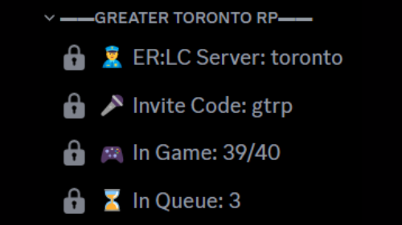

# ER:LC API Commands


### Disclaimer

This plugin uses the InvenTutor Pro system. Please check the [About InvenTutor Pro](https://app.gitbook.com/s/6H1YA21Oj3zO6OvS8OBs/about-inventutor-pro "mention") page before installing.


***


### **Release News**

This plugin is pending due to an bug reported [here](https://forum.inventor.gg/t/flow-attempting-to-use-an-non-existant-cb/4633/3?u=8bitoe).


***

## Features

* Multiple ER:LC servers per 1 Discord server
* Multiple Discord servers can have 1 ER:LC server linked
* Easy data viewing commands
* Run commands in a ER:LC server
* Respects rate-limits
* [⭐](https://app.gitbook.com/s/6H1YA21Oj3zO6OvS8OBs/about-inventutor-pro) [Easily integrate the ER:LC API into your Components](integrate-api-into-components.md)

***

## [⭐ Pro](https://app.gitbook.com/s/6H1YA21Oj3zO6OvS8OBs/about-inventutor-pro) Features

* No Branding
* [Integrate the API easily into Components and Plugins](integrate-api-into-components.md)
* Higher ER:LC Rate-limits (Global API Key) (TBA)

***

## Planned Features

* Command Templates with autocompletes for server, 4 values
* ER:LC API action triggers  - Example: a player joins the game: a GV gets created
* Inventor plan Network Request limit usage protector depending on plan
* Higher rate-limits (Global API key requests are currently closed)
* Channel game stats

<figure><figcaption>
Channel game stats example from a ER:LC server managing service
</figcaption></figure>

Long-term:

* Custom emojis
* Custom message templates
